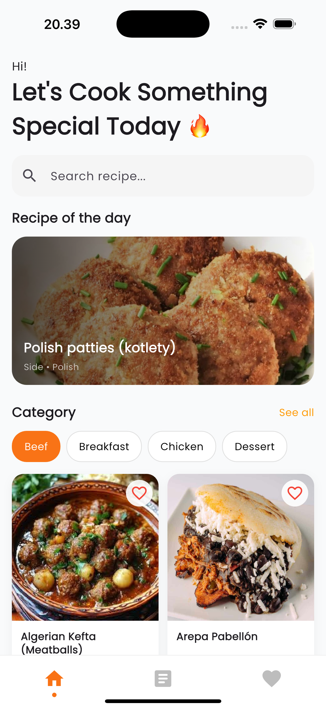
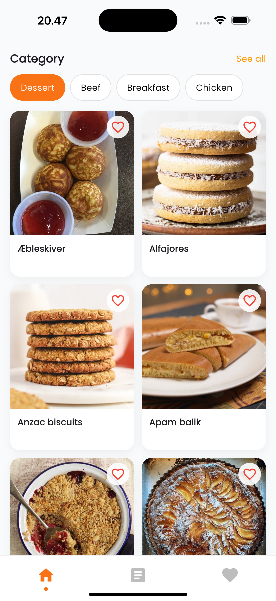
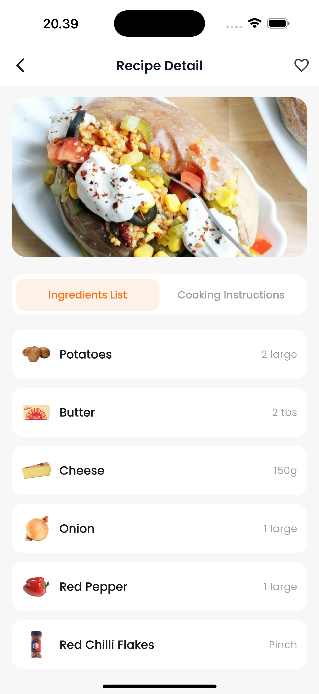
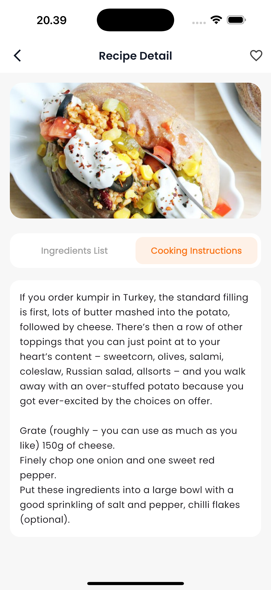
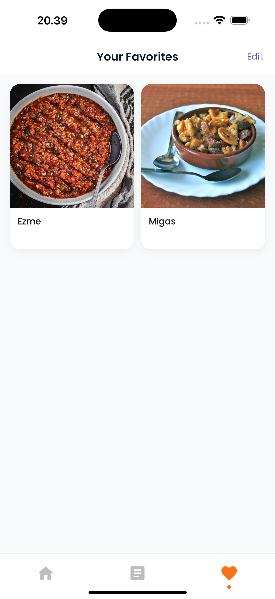
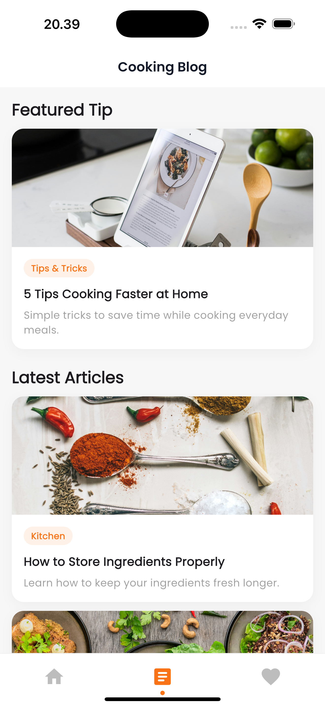
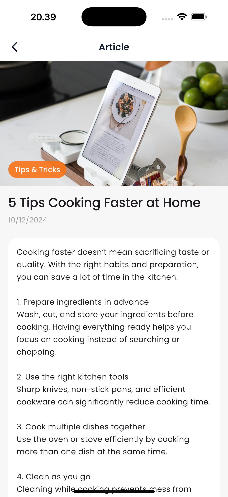

# 🍽️ Food Receipt App

A modern **Flutter-based recipe application** that allows users to explore recipes, discover cooking tips, and manage their favorite meals with a clean and intuitive UI.

Built with **Flutter**, **Riverpod**, **GoRouter**, and **SQLite**, this app focuses on **clean architecture**, **smooth UX**, and **scalable state management**.

---

## ✨ Features

- 🔍 **Search Recipes** using TheMealDB API
- 🍛 **Random Recipe Banner** (Recipe of the Day)
- 🧩 **Browse Recipes by Category**
- ❤️ **Favorite Recipes**
  - Save & remove favorites
  - Stored locally using SQLite
- 📰 **Blog Section**
  - Cooking tips & kitchen articles
  - Clean article detail page
- 📱 **Responsive UI**
  - Optimized for various screen sizes
- ⚡ **Image Caching**
  - Powered by `cached_network_image`
- 🧠 **State Management**
  - Using Riverpod
- 🧭 **Navigation**
  - Implemented with GoRouter

---

## 📸 Screenshots

### Splash & Home

<p align=""> 
   
  
   
</p> 
 <p align="">  </p>

### Recipe & Detail

<p align=""> 
   
  
  
</p>

### Favorites

<p align=""> 
   
 
</p>

### Blog

<p align=""> 
   
     
 
</p>

---

## 🛠️ Tech Stack

- **Flutter**
- **Dart**
- **Riverpod** – State Management
- **GoRouter** – Navigation
- **Dio** – REST API client
- **SQLite (sqflite)** – Local database
- **Cached Network Image** – Image caching

---

## 🌐 API Source

- [TheMealDB API](https://www.themealdb.com/)
  - Random meal
  - Search meals
  - Filter by category
  - Meal detail

---

## 🗂️ Project Structure

```text
lib/
├── config/
├── core/
│   ├── dio_client.dart
│   └── widgets/
├── features/
│   ├── splash/
│   ├── home/
│   ├── favorite/
│   ├── blog/
│   └── meal_detail/
├── models/
├── data/
├── local_db/
├── providers/
├── repositories/
└── routes/
```

---

## 🚀 Getting Started

### 1. Clone the repository

```bash
git clone https://github.com/wilskys/food_receipt
```

### 2. Install dependencies

```bash
flutter pub get
```

### 3. Run the app

```bash
flutter run
```

---

## 📌 Notes

- Follows clean architecture principles
- Modular, reusable UI components
- Easily extendable for future features

---

## 👨‍💻 Author

Developed by **Your Name**  
📧 Email: wildan.romiza@gmail.com

---

## 📄 License

This project is for educational and demonstration purposes.
